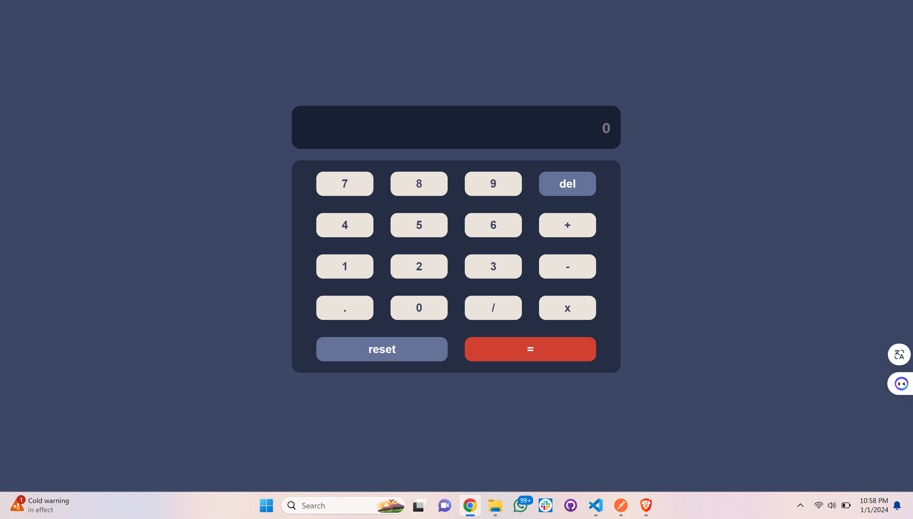
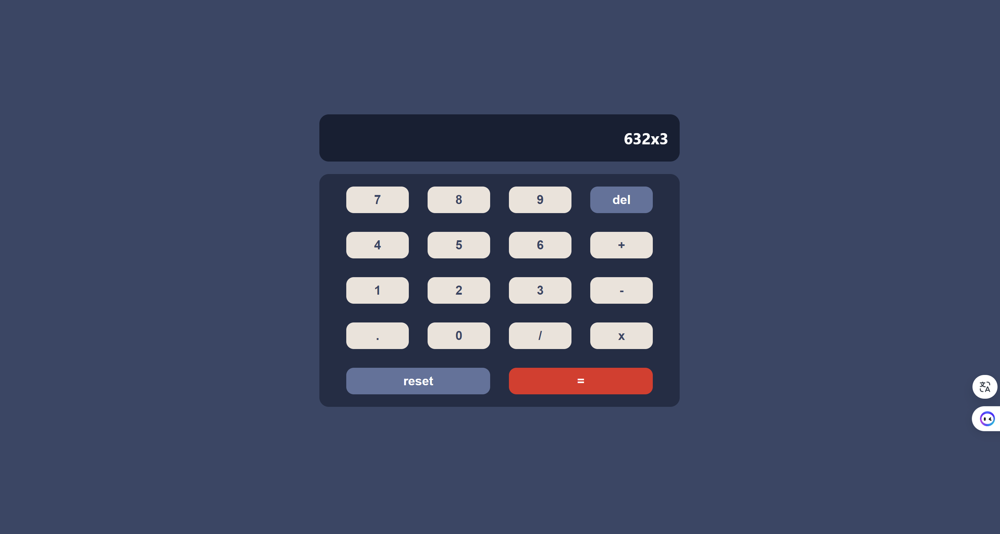

# Cuvette Micro Project 4 - Calculator

This project is a simple web-based calculator created as a micro project for the cuvette institution. The calculator allows users to perform basic arithmetic operations.

## Features

- Addition
- Subtraction
- Multiplication
- Division
- Reset function
- Delete function

## Usage

1. Clone the repository:

    ```bash
    git clone https://github.com/Akshat53/cuvette-micro-project-4.git
    ```

2. Open the `index.html` file in your web browser.

3. Use the calculator buttons to perform calculations.

## Screenshots


*Description of the screenshot (e.g., Basic Calculator View)*


*Description of the screenshot (e.g., Calculator performing a calculation)*

## Contributing

Contributions are welcome! If you'd like to contribute to the project, follow these steps:

1. Fork the repository.
2. Create a new branch (`git checkout -b feature/add-new-feature`).
3. Make your changes.
4. Commit your changes (`git commit -am 'Add new feature'`).
5. Push to the branch (`git push origin feature/add-new-feature`).
6. Create a new Pull Request.

## License

This project is licensed under the MIT License - see the [LICENSE](LICENSE) file for details.
